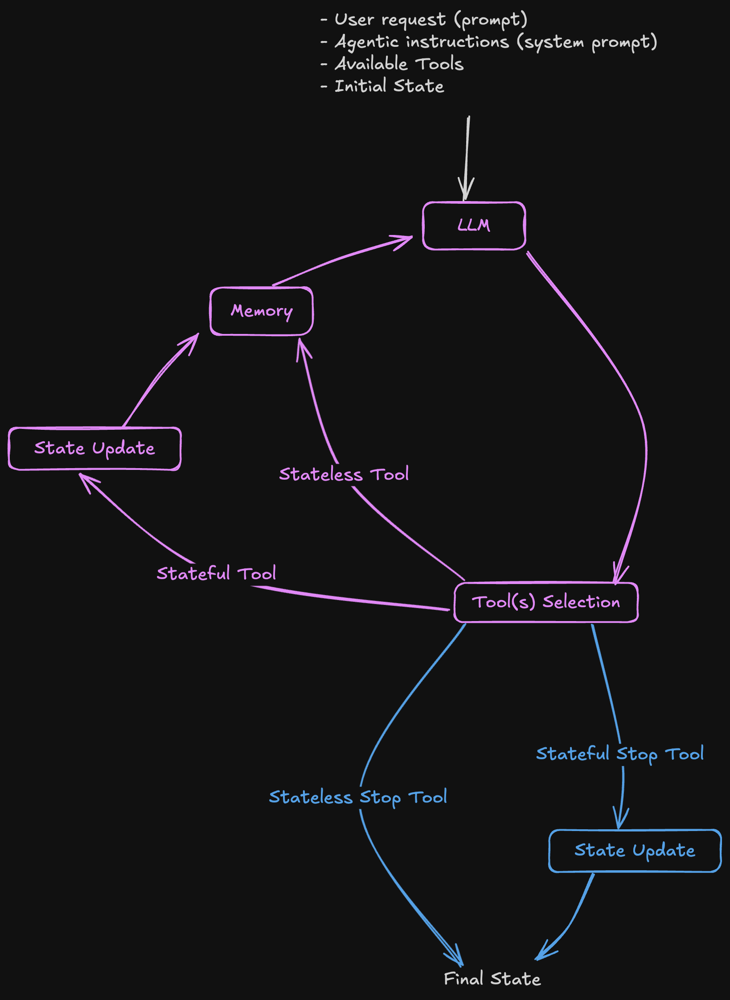

# Explicit Agent Framework

A minimalist, transparent framework for building AI agents with full user control.

## Why Explicit Agent?

Most agentic frameworks are overengineered with layers of abstraction that obscure what's actually happening. Explicit Agent cuts through the BS to provide:

- **Complete transparency**: No hidden prompts or "magic" under the hood
- **Full control**: You define exactly how your agent behaves
- **Minimal infrastructure**: Only the essentials needed to run capable AI agents
- **Simplicity first**: Build complex behaviors from simple, understandable components

This framework was created to put control back in your hands. It provides the minimum viable infrastructure for running AI agents while maintaining full visibility into their operation.

## Core Concepts



The Explicit Agent Framework is built around a few simple concepts that work together to create powerful, transparent AI agents.


### Agent State

The agent maintains a state that persists across tool calls and interactions. This allows tools to share information and build on previous results. The state can be initialized when creating the agent and is updated by "stateful" tools.

### Tool Types

The framework supports four types of tools:

- **StatelessTool**: Standard tools that execute a function and return a result. These tools don't have access to or modify the agent's state.
  
- **StatefulTool**: Tools that receive the current state and return a result. These are perfect for tools that need to read from or write to the agent's persistent memory.
  
- **StopStatelessTool**: Special stateless tools that signal when the agent should stop execution. They return a result and prevent further tool calls.

- **StopStatefulTool**: Special stateful tools that signal when the agent should stop execution. They receive the final state, return a result, and prevent further tool calls.

### Execution Flow

1. The agent receives a prompt from the user
2. The agent generates tool calls based on the prompt and system instructions
3. The tools are executed, potentially updating the agent's state
4. The results are fed back to the agent
5. This continues until a Stop tool is called or the budget is exhausted

## Installation

```bash
# Clone the repository
git clone https://github.com/gabriansa/explicit-agent.git
cd explicit-agent

# Install the package
pip install e .
```

## Quick Start

### 1. Create Your Tools

Tools are the core components of the Explicit Agent framework. You can create four types of tools:

```python
from explicit_agent.tools import StatelessTool, StatefulTool, StopStatelessTool, StopStatefulTool
from typing import Optional, Any

# 1. Stateless Tool - Simple tools that don't need to maintain state
class Add(StatelessTool):
    """Add two numbers"""
    a: int
    b: int

    def execute(a, b):
        return a + b

# 2. Stateful Tool - Tools that access and modify agent state
class AddToCart(StatefulTool):
    """Add an item to the shopping cart"""
    item: str
    quantity: int
    price: float

    def execute(state, item: str, quantity: int, price: float):
        if item in state.items:
            state.items[item]['quantity'] += quantity
        else:
            state.items[item] = {'quantity': quantity, 'price': price}
        
        return f"Added {quantity} {item}(s) at ${price:.2f} each"

# 3. Stop Tools - Tools that signal the agent to stop execution
class Checkout(StopStatefulTool):
    """Checkout the shopping cart"""
    
    def execute(state):
        total = sum(item['quantity'] * item['price'] for item in state.items.values())
        return f"Checkout complete! Total: ${total:.2f}"
```

### 2. Create an Agent

Initialize an agent with your desired configuration:

```python
from explicit_agent import ExplicitAgent
import os

# Create an agent with your API key and optional settings
agent = ExplicitAgent(
    api_key=<your_openai_api_key>,
    system_prompt="You are a helpful assistant that uses tools to solve problems.",
    initial_state=None,  # Optional: Provide initial state for stateful tools
    verbose=True  # Show detailed logs
)
```

### 3. Run Your Agent

Run the agent with your tools and prompt:

```python
# Define a shopping cart state
class ShoppingCartState:
    def __init__(self):
        self.items = {}

# Create tools
tools = [AddToCart, ViewCart, Checkout]

# Define your user prompt
prompt = "Add 2 apples at $1.50 each and 1 banana at $0.75 to my cart. Then checkout."

# Run the agent
final_state = agent.run(
    model="gpt-4o-mini",  # Choose your preferred model
    prompt=prompt,
    budget=10,  # Maximum number of iterations
    tools=tools,
    initial_state=ShoppingCartState(),  # For stateful tools
    tool_choice="auto",
    parallel_tool_calls=False  # Process tools sequentially
)

print(final_state)  # Final state or output from Stop tool
```

### 4. Complete Example

Here's a simple calculator agent:

```python
from explicit_agent import ExplicitAgent
from explicit_agent.tools import StatelessTool, StopStatelessTool
import os

# Define calculator tools
class Add(StatelessTool):
    """Add two numbers"""
    a: int
    b: int
    
    def execute(a, b):
        return a + b

class Multiply(StatelessTool):
    """Multiply two numbers"""
    a: int
    b: int
    
    def execute(a, b):
        return a * b

class FinishCalculation(StopStatelessTool):
    """Finish the calculation"""
    result: int
    
    def execute(result):
        return result

# Create and run the agent
agent = ExplicitAgent(
    api_key=<your_openai_api_key>,
    system_prompt="You are a calculator. Use the tools to perform calculations."
)

final_state = agent.run(
    model="gpt-4o-mini",
    prompt="Calculate (3 + 4) * 5",
    tools=[Add, Multiply, FinishCalculation]
)

print(final_state)  # Output: 35
```

## Examples

For more advanced usage and detailed documentation, see the examples directory.

## License

This project is licensed under the MIT License - see the LICENSE file for details.
